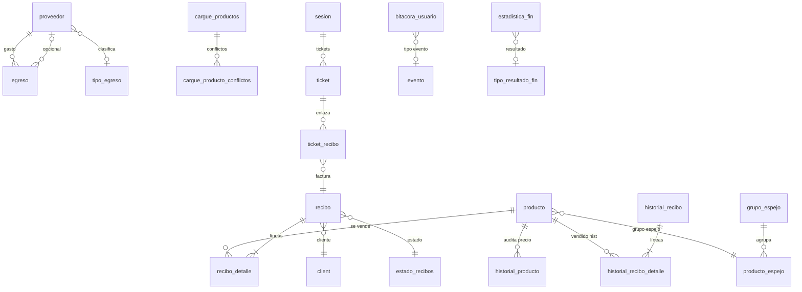

# Inventario de base de datos — estado actual (antes de InfluxDB y entradas de inventario)

**Fecha de captura:** 2026-05-30  
**Base de datos:** `controlneg_rmx_db`  
**Motor:** PostgreSQL  
**Rama activa del MS negocio:** `feature/prod`  
**Contexto:** snapshot previo a (1) migrar logs de `public.app_log` a InfluxDB (rama `feature/influx`) y (2) diseñar la funcionalidad de **entradas de inventario desde soportes escaneados (OCR)**.

**Conexión usada** (`application.properties`):

```
jdbc:postgresql://localhost:5432/controlneg_rmx_db
usuario: romax-admin
```

**Schemas:** `public` (negocio POS) · `security` (usuarios/roles, compartido con `infinito-security`)

---

## 1. Resumen ejecutivo

| Métrica | Valor |
|---|---|
| Tablas en `public` | 33 |
| Tablas en `security` | 5 |
| Entidades JPA en el MS | 34 clases `@Entity` |
| Tablas sin entidad JPA | 3 (`app_log`, `producto_espejo`, `security.usuario_roles`) |
| Entidades JPA sin tabla en BD | 2 (`migracion_productos`, `migracion_producto_conflictos`) |
| Registros en `producto` | 3 167 |
| Registros en `app_log` | 21 806 |
| Campo de inventario/stock en BD | **No existe** |

### Hallazgo clave para entradas de inventario

El modelo actual **no tiene inventario físico**: `producto` guarda precios, estado activo y métricas de venta, pero **no cantidad en bodega, mínimos ni movimientos de entrada/salida**. Lo más cercano es:

- **`cargue_productos` + `cargue_producto_conflictos`**: importación masiva desde archivo (xlsx/csv) con resolución de conflictos — patrón reutilizable para cargas asistidas.
- **`historial_producto`**: auditoría de cambios de **precio/estado**, no de cantidades.
- **`proveedor` + `egreso`**: proveedores y gastos; no hay recepción de mercancía ni factura de compra.
- **`precio_compra`** en `producto`: único dato de costo persistido; podría actualizarse en una entrada, pero hoy no hay flujo de “compra/recibo”.

---

## 2. Diagrama de dominios (relaciones principales)



---

## 3. Conteo de filas por tabla (2026-05-30)

### Schema `public`

| Tabla | Filas | Dominio |
|---|---:|---|
| `app_log` | 21 806 | Logs aplicación (Log4j → Postgres) |
| `bitacora_usuario` | 596 | Auditoría acciones usuario |
| `cargue_producto_conflictos` | 329 | Conflictos en importación productos |
| `cargue_productos` | 1 | Cabecera importaciones productos |
| `client` | 85 | Clientes |
| `company` | 0 | Empresa (sin uso) |
| `configuracion_app` | 5 | Clave-valor configuración |
| `corte_venta` | 71 | Cortes de caja |
| `edicion_recibo` | 18 | Ediciones de facturas |
| `edicion_recibo_detalle` | 65 | Detalle ediciones |
| `egreso` | 3 | Gastos |
| `estadistica_fin` | 37 | Estadísticas financieras |
| `estado_recibos` | 4 | Catálogo estados factura |
| `evento` | 16 | Catálogo eventos bitácora |
| `flujo_dinero` | 42 | Flujo diario |
| `grupo_espejo` | 2 | Grupos producto espejo |
| `historial_producto` | 3 166 | Historial precio/estado producto |
| `historial_recibo` | 7 792 | Facturas cerradas |
| `historial_recibo_detalle` | 15 513 | Líneas facturas históricas |
| `metodo_pago` | 3 | Métodos de pago |
| `producto` | 3 167 | Catálogo productos |
| `producto_espejo` | 10 | Pivote producto ↔ grupo espejo |
| `proveedor` | 27 | Proveedores |
| `recibo` | 7 828 | Facturas activas |
| `recibo_detalle` | 33 | Líneas factura activa |
| `recibo_detalle_historico` | 23 309 | Auditoría cambios líneas |
| `sesion` | 62 | Sesiones POS |
| `ticket` | 62 | Tickets de venta |
| `ticket_recibo` | 75 | Enlace ticket ↔ recibo |
| `tipo_conflicto` | 0 | Catálogo conflictos import (vacío) |
| `tipo_egreso` | 8 | Tipos de egreso |
| `tipo_resultado_fin` | 16 | Tipos resultado financiero |
| `ventas_tipo` | 188 | Ventas por método en corte |

### Schema `security`

| Tabla | Filas | Notas |
|---|---:|---|
| `roles` | 3 | ADMIN, VENDEDOR, SUPERVISOR |
| `usuario` | 6 | Usuarios del sistema |
| `usuario_perfil` | 2 | Personalización JSON |
| `usuario_rol` | 12 | Pivote usuario ↔ rol (activo) |
| `usuario_roles` | 0 | Pivote legacy/duplicado, sin datos |

---

## 4. Tablas detalladas por dominio

### 4.1 Productos e importación

#### `producto` — entidad `Product`

| Columna | Tipo | Nullable | Default | JPA |
|---|---|---|---|---|
| `id` | bigint | NO | serial | `@Id` |
| `codigo_barras` | varchar(100) | YES | — | `barcode` (unique en JPA, **sin UK en BD**) |
| `nombre` | varchar(255) | NO | — | `nombre` |
| `precio` | numeric(10,2) | YES | — | `precio` |
| `precio_compra` | numeric(10,2) | NO | 0 | `precioCompra` |
| `precio_unidad` | numeric(10,2) | YES | — | `precioUnidad` |
| `activate` | integer | NO | 1 | `activate` (1=activo, 0=baja) |
| `fecha_actualizacion_precio` | timestamp | YES | — | `fechaUltimaActualizacionPrecio` |
| `fecha_creacion` | timestamptz | YES | now() | `fechaCreacion` |
| `total_ventas` | integer | YES | 0 | `totalVentas` |
| `fecha_ultima_venta` | date | YES | — | `fechaUltimaVenta` |
| `porcentaje_ganancia` | smallint | YES | — | `porcentajeGanancia` |

**Índices reales:** solo PK (`producto_pkey`). El script `create_database.sql` define índices adicionales que **no están aplicados** en esta BD.

#### `historial_producto` — entidad `HistorialProducto`

Auditoría de producto. Eventos observados: `manual creation`, `cargue inicial 2026`.

| Columna | Tipo | FK |
|---|---|---|
| `id` | bigint PK | — |
| `producto_id` | bigint | → `producto.id` |
| `evento` | varchar(100) | texto libre |
| `precio` | numeric(10,2) | snapshot precio |
| `fecha_creacion` | timestamp | — |
| `activo` | boolean | snapshot estado |

#### `cargue_productos` — entidad `CargueProducto`

Cabecera de importación masiva (`POST /api/cargue-productos` multipart).

| Columna | Tipo | Descripción |
|---|---|---|
| `id` | serial PK | — |
| `nombre` | varchar(255) | nombre del cargue |
| `fecha_creacion` | timestamp | — |
| `total_migrados` | integer | productos creados |
| `total_conflictos` | integer | conflictos detectados |
| `total_conflictos_resultos` | integer | conflictos resueltos |
| `mensajes_error` | text | errores globales |

#### `cargue_producto_conflictos` — entidad `CargueProductoConflicto`

| Columna | Tipo | FK |
|---|---|---|
| `id` | serial PK | — |
| `cargue_prod_id` | integer | → `cargue_productos.id` |
| `tipo_conflicto_id` | integer | enum `TipoConflicto` (sin FK BD) |
| `nombre_producto` | varchar(255) | — |
| `datos_conflicto` | json | payload del conflicto |
| `resuelto` | boolean | default false |

Tipos de conflicto (enum Java): `DOS_PRODUCTOS_NOMBRES_IGUALES`, `IGUAL_NOMBRE_Y_CODIGO_BARRAS`, `NO_TIENE_PRECIO`.

#### `grupo_espejo` — entidad `GrupoEspejo`

Agrupación de productos equivalentes (precios espejo).

| Columna | Tipo | FK |
|---|---|---|
| `id` | bigint PK | — |
| `nombre` | varchar(100) | — |
| `fecha_creacion` | timestamp | — |
| `fecha_actualizacion` | timestamp | — |
| `producto_referencia_id` | bigint | → `producto.id` |

#### `producto_espejo` — **sin entidad JPA**

Tabla pivote Many-to-Many; gestionada por queries nativas en `GrupoEspejoRepository` y `@JoinTable` read-only en `Product`.

| Columna | Tipo | FK |
|---|---|---|
| `id` | bigint PK | — |
| `grupo_espejo_id` | bigint | → `grupo_espejo.id` |
| `producto_id` | bigint | → `producto.id` |
| `fecha_creacion` | timestamp | — |

#### Entidades huérfanas (JPA sin tabla)

| Entidad | Tabla esperada | Estado |
|---|---|---|
| `MigracionProducto` | `migracion_productos` | **No existe en BD** |
| `MigracionProductoConflicto` | `migracion_producto_conflictos` | **No existe en BD** |

Existen controladores `/api/migracion-productos`; en producción se usa `cargue_productos` como flujo vigente.

---

### 4.2 Ventas y facturación

#### `recibo` — entidad `Recibo`

Factura activa en caja.

| Columna | Tipo | Notas |
|---|---|---|
| `id` | bigint PK | — |
| `cliente_id` | bigint | → `client.id` (sin FK en BD) |
| `estado_id` | bigint | → `estado_recibos.id` |
| `metodo_pago_id` | bigint | → `metodo_pago.id` |
| `sesion_id` | bigint | → `sesion.id` |
| `total`, `monto_recibido` | numeric(10,2) | — |
| `fecha_creacion` | timestamp | — |
| `recibo_padre_id` | bigint | facturas derivadas |

Estados catálogo: Abierto (ABT), Pagado (PAG), Anulado (ANU), Pendiente (PEN).

#### `recibo_detalle` — entidad `ReciboDetalle`

| Columna | Tipo | FK |
|---|---|---|
| `id` | bigint PK | — |
| `recibo_id` | bigint | → `recibo.id` |
| `producto_id` | bigint | → `producto.id` |
| `cantidad` | integer | unidades vendidas |
| `subtotal` | numeric(10,2) | — |
| `fecha_creacion` | timestamp | — |
| `usuario_creacion` | uuid | ref. `security.usuario` |

> **Nota:** `cantidad` aquí es cantidad **vendida en una factura**, no stock en bodega.

#### `historial_recibo` / `historial_recibo_detalle`

Copia de facturas cerradas. Misma estructura que `recibo`/`recibo_detalle`.

#### `edicion_recibo` / `edicion_recibo_detalle`

Borrador de edición de factura antes de confirmar.

#### `recibo_detalle_historico` — entidad `ReciboDetalleHistorico`

Auditoría de cambios en líneas (`accion`, `usuario_id`, `fecha_hora`). Sin FK formal a `recibo_detalle` (mismatch INTEGER vs BIGINT).

#### `ticket` / `ticket_recibo` / `sesion`

Flujo multi-ticket por sesión de caja. `ticket_recibo` tiene UK `(ticket_id, recibo_id)`.

---

### 4.3 Finanzas

#### `egreso` — entidad `Egreso`

| Columna | Tipo | FK |
|---|---|---|
| `id` | serial PK | — |
| `fecha` | date | — |
| `valor` | numeric(15,2) | — |
| `descripcion` | text | — |
| `fecha_creacion` | timestamp | default now |
| `proveedor_id` | integer | → `proveedor.id` |

#### `proveedor` — entidad `Proveedor`

| Columna | Tipo | Restricción |
|---|---|---|
| `id` | serial PK | — |
| `documento` | varchar(50) | UNIQUE |
| `nombre` | varchar(150) | — |
| `telefono` | varchar(30) | — |
| `correo` | varchar(100) | — |
| `tipo_egreso_id` | integer | → `tipo_egreso.id` |

#### `estadistica_fin` — entidad `EstadisticaFin`

Cierres diarios/mensuales/anuales: `total_egresos`, `total_ventas`, `utilidad`, `formato_tiempo`, `valor_tiempo`.

#### `corte_venta` / `ventas_tipo` / `flujo_dinero` / `tipo_egreso` / `tipo_resultado_fin`

Soporte a cortes de caja, clasificación de egresos y reportes financieros.

---

### 4.4 Auditoría y configuración

#### `bitacora_usuario` — entidad `BitacoraUsuario`

| Columna | Tipo | Descripción |
|---|---|---|
| `id` | serial PK | — |
| `user_id` | uuid | ref. `security.usuario` (sin FK) |
| `evento_id` | integer | → `evento.id` |
| `valor_antes` | json | snapshot previo |
| `valor_despues` | json | snapshot posterior |
| `fecha_creacion` | timestamp | — |
| `referencia_id` | integer | ID entidad afectada |

Catálogo `evento` (16 filas): INI_SESION, REG_PROD, MOD_PROD, IMPORT_PROD, REG_EGRESO, REG_FACT, etc. **No hay evento de entrada de inventario.**

#### `configuracion_app` — entidad `ConfiguracionApp`

Claves actuales:

| key | Uso |
|---|---|
| `total-productos` / `total-productos-activos` | contadores cacheados |
| `longitud-vertical-panel-productos` | UI |
| `alerta-precios` | JSON umbrales ganancia |
| `ultimo-corte-egresos` | fecha último corte |

#### `app_log` — **sin entidad JPA**

Persistencia de logs vía `DbAppender` (Log4j2). Estructura:

| Columna | Tipo |
|---|---|
| `id` | bigserial PK |
| `fecha` | timestamp (default now) |
| `nivel` | varchar(10) |
| `logger` | varchar(255) |
| `mensaje` | text |
| `excepcion` | text |
| `thread` | varchar(100) |

Índices: `idx_app_log_fecha`, `idx_app_log_nivel`.

**Estado en rama `feature/prod`:** 21 806 filas en Postgres.  
**En rama `feature/influx`:** logs van a InfluxDB 3 (`monitor.influx.*`, database `infinito_logs`); `app_log` dejaría de recibir tráfico nuevo.

---

### 4.5 Clientes y catálogos

| Tabla | Entidad | Filas |
|---|---|---:|
| `client` | `Client` | 85 |
| `company` | `Company` (default table name) | 0 |
| `metodo_pago` | `MetodoPago` | 3 |
| `estado_recibos` | `EstadoRecibo` | 4 |
| `evento` | `Evento` | 16 |
| `tipo_conflicto` | enum `TipoConflicto` (no `@Entity`) | 0 |

---

### 4.6 Schema `security` (compartido con MS auth)

| Tabla | Entidad JPA en MS negocio | Filas |
|---|---|---:|
| `usuario` | — (solo referenciado por UUID) | 6 |
| `roles` | — | 3 |
| `usuario_rol` | — | 12 |
| `usuario_perfil` | `UsuarioPerfil` (**schema no declarado en `@Table`**) | 2 |
| `usuario_roles` | — (legacy, vacía) | 0 |

> **Discrepancia:** `create_database.sql` define `usuario_perfil` en schema `security` con `id BIGSERIAL`, pero la BD actual tiene `usuario_perfil` en **schema `security`** con `id INTEGER`. La entidad `UsuarioPerfil` no declara `schema = "security"`.

---

## 5. Matriz JPA ↔ PostgreSQL

| Entidad Java | Tabla BD | Schema | Estado |
|---|---|---|---|
| `Product` | `producto` | public | OK |
| `HistorialProducto` | `historial_producto` | public | OK |
| `CargueProducto` | `cargue_productos` | public | OK |
| `CargueProductoConflicto` | `cargue_producto_conflictos` | public | OK |
| `MigracionProducto` | `migracion_productos` | — | **Tabla ausente** |
| `MigracionProductoConflicto` | `migracion_producto_conflictos` | — | **Tabla ausente** |
| `GrupoEspejo` | `grupo_espejo` | public | OK |
| — | `producto_espejo` | public | Solo SQL nativo |
| `Recibo` | `recibo` | public | OK |
| `ReciboDetalle` | `recibo_detalle` | public | OK |
| `ReciboDetalleHistorico` | `recibo_detalle_historico` | public | OK |
| `HistorialRecibo` | `historial_recibo` | public | OK |
| `HistorialReciboDetalle` | `historial_recibo_detalle` | public | OK |
| `EdicionRecibo` | `edicion_recibo` | public | OK |
| `EdicionReciboDetalle` | `edicion_recibo_detalle` | public | OK |
| `Ticket` | `ticket` | public | OK |
| `TicketRecibo` | `ticket_recibo` | public | OK |
| `Sesion` | `sesion` | public | OK |
| `Client` | `client` | public | OK |
| `Company` | `company` | public | OK |
| `MetodoPago` | `metodo_pago` | public | OK |
| `EstadoRecibo` | `estado_recibos` | public | OK |
| `Egreso` | `egreso` | public | OK |
| `Proveedor` | `proveedor` | public | OK |
| `TipoEgreso` | `tipo_egreso` | public | OK |
| `EstadisticaFin` | `estadistica_fin` | public | OK |
| `TipoResultadoFin` | `tipo_resultado_fin` | public | OK |
| `CorteVenta` | `corte_venta` | public | OK |
| `VentasTipo` | `ventas_tipo` | public | OK |
| `FlujoDinero` | `flujo_dinero` | public | OK |
| `BitacoraUsuario` | `bitacora_usuario` | public | OK |
| `Evento` | `evento` | public | OK |
| `ConfiguracionApp` | `configuracion_app` | public | OK |
| `UsuarioPerfil` | `usuario_perfil` | security | Schema no en anotación |
| — | `app_log` | public | Log4j DbAppender |
| — | `tipo_conflicto` | public | Enum Java, tabla vacía |
| — | `usuario_roles` | security | Legacy sin uso |

**Enum sin tabla activa:** `TipoConflicto` (mapeo por ID a filas de `tipo_conflicto`, actualmente vacía — el enum es la fuente de verdad en runtime).

---

## 6. Foreign keys declaradas en BD

| Tabla origen | Columna | Tabla destino |
|---|---|---|
| `bitacora_usuario` | `evento_id` | `evento.id` |
| `cargue_producto_conflictos` | `cargue_prod_id` | `cargue_productos.id` |
| `edicion_recibo_detalle` | `edicion_id` | `edicion_recibo.id` |
| `egreso` | `proveedor_id` | `proveedor.id` |
| `estadistica_fin` | `tipo_resultado_fin_id` | `tipo_resultado_fin.id` |
| `grupo_espejo` | `producto_referencia_id` | `producto.id` |
| `historial_producto` | `producto_id` | `producto.id` |
| `historial_recibo_detalle` | `recibo_id` | `historial_recibo.id` |
| `producto_espejo` | `grupo_espejo_id`, `producto_id` | `grupo_espejo`, `producto` |
| `proveedor` | `tipo_egreso_id` | `tipo_egreso.id` |
| `recibo_detalle` | `recibo_id`, `producto_id` | `recibo`, `producto` |
| `ticket` | `sesion_id` | `sesion.id` |
| `ventas_tipo` | `metodo_pago_id` | `metodo_pago.id` |
| `usuario_rol` | `usuario_id`, `rol_id` | `usuario`, `roles` |
| `usuario_roles` | `usuario_id`, `rol_id` | `usuario`, `roles` |

Muchas relaciones lógicas (`recibo.cliente_id`, `recibo.estado_id`, etc.) **no tienen FK en BD** — se gestionan solo en JPA/aplicación.

---

## 7. Discrepancias BD ↔ JPA ↔ scripts SQL

| Tema | Detalle |
|---|---|
| UK `producto.codigo_barras` | En `create_database.sql` sí; en BD actual **no existe** (solo anotación JPA) |
| Índices de rendimiento | Definidos en `create_database.sql` pero **no aplicados** en BD actual |
| `usuario_perfil.schema` | Script y BD usan `security`; entidad no declara schema |
| `migracion_*` vs `cargue_*` | Dos flujos paralelos en código; solo `cargue_*` existe en BD |
| `recibo_detalle_historico.recibo_detalle_id` | INTEGER en BD vs BIGINT en `recibo_detalle.id` |
| `sesion.user_id` | Nullable en BD; script original lo marca NOT NULL |
| Logs | `feature/prod`: Postgres `app_log`; `feature/influx`: InfluxDB 3 |
| Inventario | CSV estático `INVENTARIO_OCTUBRE_10.csv` tiene columna Inventario; **no hay columna equivalente en BD** |

---

## 8. Implicaciones para la feature “entrada de inventario desde OCR”

### Lo que ya existe y se puede reutilizar

| Pieza | Cómo ayuda |
|---|---|
| `POST /api/cargue-productos` (multipart) | Patrón upload archivo + cabecera + conflictos |
| `cargue_producto_conflictos.datos_conflicto` (JSON) | Guardar líneas OCR con baja confianza / match ambiguo |
| `proveedor` | Identificar proveedor del soporte de entrega |
| `producto.codigo_barras`, `nombre` | Matching OCR → producto existente |
| `producto.precio_compra` | Actualizar costo en entrada |
| `historial_producto` | Podría extenderse o complementarse para registrar cambios |
| `bitacora_usuario` + `evento` | Nueva sigla tipo `REG_ENTRADA_INV` |
| Almacenamiento imágenes | Existe `/api/images/*` en frontend (fuera de este inventario) |

### Lo que **falta** en el modelo actual

| Necesidad | Estado |
|---|---|
| Cantidad en stock por producto | No existe |
| Documento/soporte escaneado (PDF/imagen) | No hay tabla de adjuntos |
| Cabecera de entrada de inventario (fecha, proveedor, # factura remisión) | No existe |
| Detalle de entrada (producto, cantidad, costo unitario) | No existe |
| Estado del procesamiento OCR (pendiente, revisado, aplicado) | No existe |
| Vinculación entrada → movimiento de stock | No existe |
| Descuento de stock en venta | No implementado (ventas no afectan inventario) |

### Tablas candidatas a crear (referencia para diseño posterior)

> Solo orientación; **no implementadas** en este snapshot.

1. `entrada_inventario` — cabecera (proveedor, fecha documento, archivo, estado OCR, usuario)
2. `entrada_inventario_detalle` — líneas (producto_id nullable, texto OCR, cantidad, costo, confianza)
3. `producto_stock` o columna `existencia` en `producto` — saldo actual
4. `movimiento_inventario` — ledger entrada/salida/ajuste (opcional, más robusto)

---

## 9. Referencias en el repo

| Recurso | Ruta |
|---|---|
| Script DDL completo | `src/main/resources/doc/create_database.sql` |
| Fixes/migraciones puntuales | `src/main/resources/doc/fixbd.sql` |
| Config conexión | `src/main/resources/application.properties` |
| Entidades JPA | `src/main/java/.../entities/` |
| DbAppender (app_log) | `src/main/java/.../logging/DbAppender.java` |
| Rama Influx (logs) | `feature/influx` — `monitor.influx.*` en `application.properties` |
| Importación productos | `CargueProductoController`, `MigrationServiceImpl` |

---

## 10. Comando para regenerar conteos

```bash
PGPASSWORD='***' psql -h localhost -U romax-admin -d controlneg_rmx_db -c "
SELECT table_schema||'.'||table_name AS tabla,
  (xpath('/row/cnt/text()', query_to_xml(format('select count(*) as cnt from %I.%I', table_schema, table_name), false, true, '')))[1]::text::bigint AS filas
FROM information_schema.tables
WHERE table_schema IN ('public','security') AND table_type='BASE TABLE'
ORDER BY 1;"
```

---

*Documento generado como línea base antes de migrar logs a InfluxDB y diseñar entradas de inventario con OCR.*
